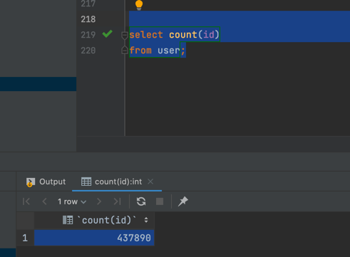
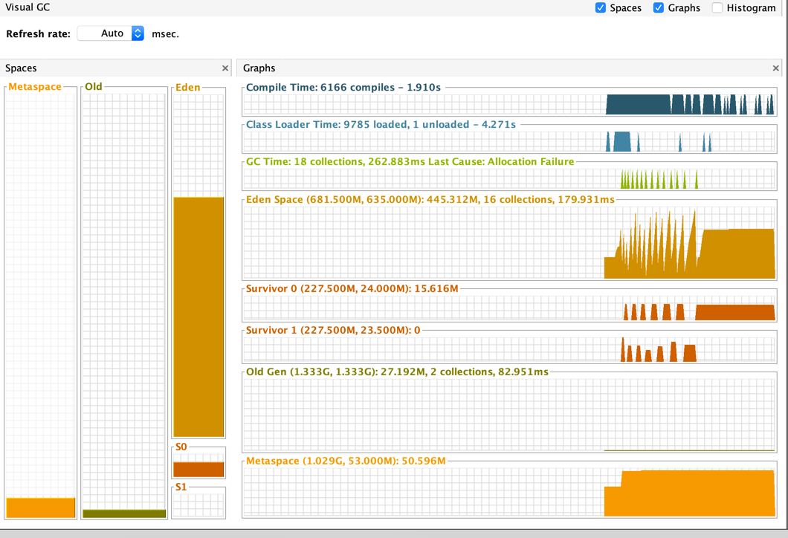

# 游标查询测试

## 背景

基于大数据集导出时出现OOM的性能改造

### 背景可观痛点

- 服务器502
- 服务卡顿
- 服务器OOM
- mysql负债增高
- linux负载增高
-

### 导入与导出

- 现阶段导入并没有发现问题,或者说导入也能有监控或用户反馈功能使用中存在失败 暂不处理

## 环境

本项目的运行环境模拟生产环境
本项目的JDK 以及项目引入的`pom`版本依赖 主要的依赖(包括jdk 、spring boot、spring mvc 、easyexcel、mybatis、mysql-driver )
基本与生产保存一致

## 方案

### ①普通查询 多次查询一次导出
#### 优点
- 实现简单,代码简洁
- 适合小数据集导出

#### 缺点
- 多次查询 查询成本高
- 触发FullGC的频率以及可能性增加
- 对宿主机的性能要求极高,比如导出10w+的数据可能需要4C16G的机器才可以完成
- 导出数据线程频繁GC影响生产其他功能使用
- OOM 生产挂机!
- 当导出中途数据库新增数据时会存在查询错乱问题

### ② 普通查询 多次查询 分批导出

#### 优点
- 实现简单,代码简洁
- 解决了多次查询一次导出时的OOM问题,降低了堆内存的使用成本,减轻服务器压力
- 适用于大数据同步导出

#### 缺点
- 多次查询 查询成本高
- 单次查询的数据量大小选择不当时会导致服务波动
- 当出现单元格合并时处理起来不是很友好
- 长时间占用一定量级的堆内存空间
- 当导出中途数据库新增数据时会存在查询错乱问题

### ③游标查询

#### 优点
- 性能稳定
- 节省堆内存空间
- 可以很友好的进行单元格合并
- 适合与大数据异步导出
- 大数据量时不会有OOM问题，相比流式查询对数据库单次占用时间较短。


#### 缺点
```html
应用指定每次查询获取的条数fetchSize，MySQL服务器每次只查询指定条数的数据，
因此单次查询相比与前面两种方式占用MySQL时间较短。但由于MySQL方不知道客户端什么时候将数据消费完，
MySQL需要建立一个临时空间来存放每次查询出的数据，大数据量时MySQL服务器IOPS、磁盘占用都会飙升，
而且需要与服务器进行更多次的网络通讯，因此最终查询效率是不如流式查询的。
```
- 实现起来稍微复杂一些
- 单次查询 长时间占用同一tcp连接 占用资源
- 每次只返回一条数据,执行时间长
- 长时间占用一定量级的堆内存空间
- 当导出中途数据库新增数据时会存在查询错乱问题
- 相比流式查询，对服务端资源消耗更大，响应时间更长

### ④流式查询

#### 优点
- 大数据量时不会有OOM问题
#### 缺点
- 占用数据库时间更长，导致网络拥塞的可能性较大。
- 
## 测试
！为了测试的准确性最好指定JVM参数
比如
```
## 根据实际的方案设置不同的jvm参数,方便形成对比
-Xms512m -Xmx1028m   -XX:+PrintGCTimeStamps   -XX:+PrintGCDetails  -verbose:gc  -Xloggc:gc.log  
```

## 性能对比
### 数据量


截图对比如下
### 分页查询 1次导出
#### jvm配置
```html
-Xms2G -Xmx2G
```
#### API
```html
GET http://localhost:8888/user/page/w
```


看代码 发现还没到导出哪一步 系统就已经完蛋了...


消耗时间:  系统垮掉!

### 分页查询 多次导出 每次查100条 直到查完数据 
#### jvm配置
```html
-Xms512m -Xmx1028m 
```
#### API
```html
GET http://localhost:8888/user/page/batchW
```


消耗时间:  我已经等待了大概20min 不等待了... 把页条数调大看看效果吧 😂

内存基本是平稳的!

发现每次查询100条数据 对于大数据量的业务并不是很友好,所以需要尽量加大🔼单次查询数据的量级
100条一页 太xx糟糕了!  单线程下 执行大数据量导出低效 还稍微吃内存！！
#### 把分页单页条数设置到5000 在试一下




消耗时间: 63351 (millis)

### 游标查询 导出
#### jvm配置
```html
-Xms50m -Xmx100m
```
#### API
```html
GET http://localhost:8888/user/write
```


消耗时间: 内存稍微小了点... 改大一下在试试

#### 该内存试一下
```html
-Xms256m -Xmx256m
```


消耗时间 29099 millis  

发现256M的内存就可以支撑对40w+数据的平稳导出  

### 生产架构设计
- 无论何种方案,再生产中坚决不能出现OOM 
- 根据生产的配置以及预算选择不同的方案
- 如果生产的服务器配置足够高,服务器性能足够优秀 分页分批导出是比较好的选择

### 代码设计
 使用策略模式指定多种导出策略
- 分页多次导出
- 游标导出
- csv文件快速导出

#### 基于游标的单元格合并导出实例 
[OrderController](src/main/java/com/mlamp/cursor/controller/OrderController.java)

## JMH benchmarking

todo

## 参考文献
- mybatis官方
- 我再b站看了一些视频 讲这块的比较少
- https://blog.csdn.net/weixin_43944305/article/details/128897778 这个写的还行
- https://blog.csdn.net/m0_61811711/article/details/125604711
- https://blog.csdn.net/m0_61811711/article/details/125604711

## 结论

还是自己写一下实践比较好 可能未来在生产会碰到一些mysql以及spring boot生产客户端使用上的问题 但是总比现在这种情况(内存 以及OOM)好多了

- 不同的解决方案都存在一定的弊端与优势,根据生产选择适用于自身服务器性能的解决方案即可
- 代码实现多种策略,根据不同场景实现不同策略

## TODO
- 实现多线程多sheet导出,提升导出策略
- 导出实现独立架构,在项目中独立出来